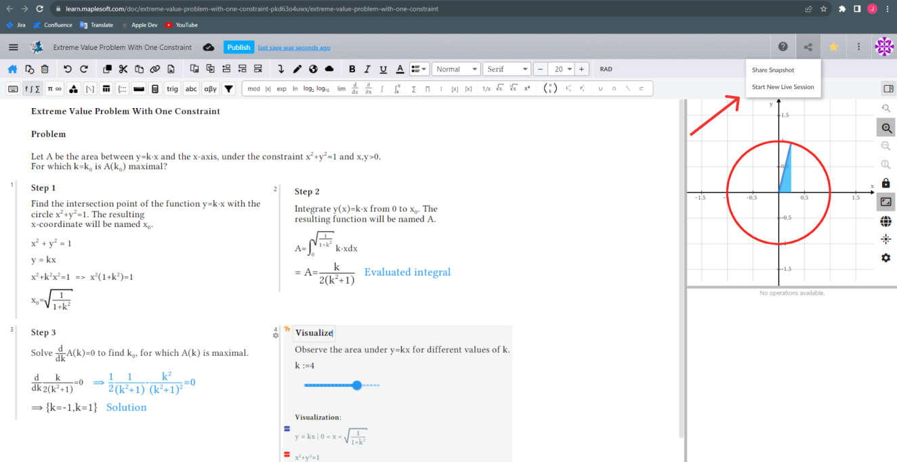
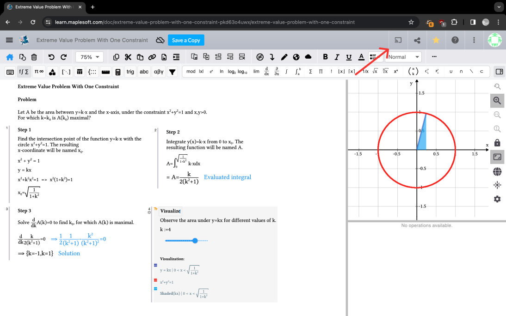
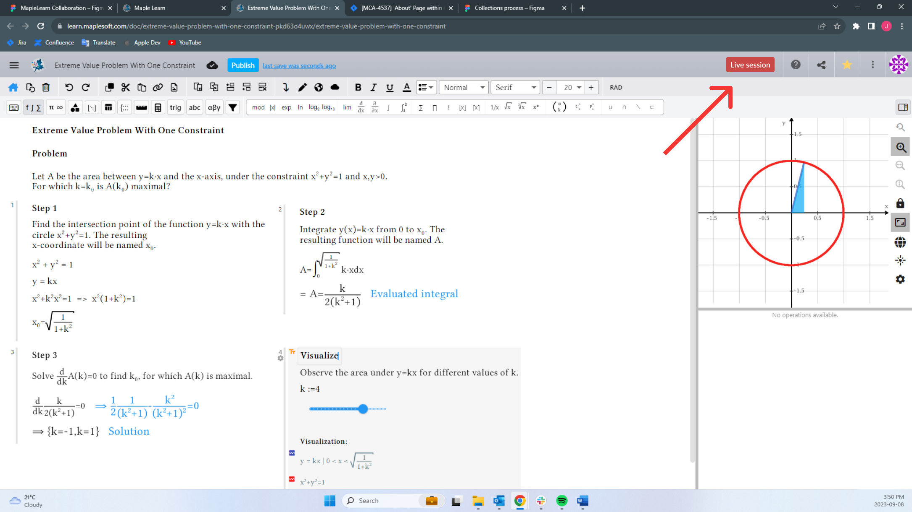
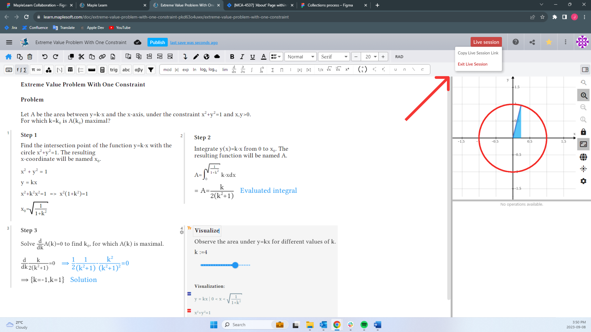

<h1>Creating the Concept</h1>

 

In order to produce the best solution in the smallest amount of time possible, we decided to add to the existing share feature rather than create a new share process.

To do so, I addressed the first part of our issue of only having an option to share a static version and added a button to start a live session. I had initially considered adding a dropdown under the current share button, as seen in the Figma mockup, but in the final iteration of the design that was released into production, we decided to add a separate button instead. This is because we wanted to highlight the new live session feature as much as possible as it could benefit most of our users greatly.

<b>Initial design:</b>

<b>Design in production:</b>

We needed to make sure the user had a way to distinguish between a "live" document and a regular, unshared document. Drawing from most users' schema of "live" indicators, such as on social media or live news, I opted for a red rectangle with the word "live session" as this indicator. 

Finally, to control a live session, I thought the most logical option was to place the controls under a dropdown accessed by clicking the red Live Session indicator button.

Of course, after discussions with the CEO, Senior Product Manager, developers, and UX/UI designer, these concepts evolved to become what is now the production version of Live Sessions in <a href="https://learn.maplesoft.com/"> Maple Learn</a>. 
