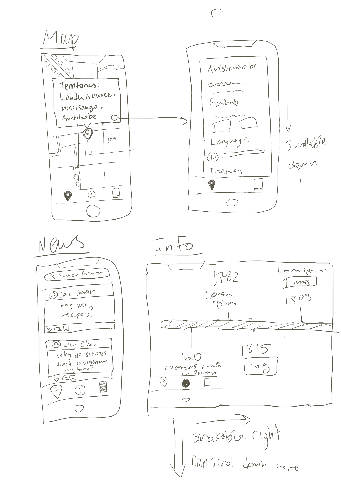

<h1>Creating the Concept</h1>
 

In the end, our Figma prototype had the same three sections we initially intended on having.

From the beginning, we had three tabs in mind in order to address each aspect of the problem: the map tab to interactively explore a map labeled according to indigenous territories, the home tab to provide more information on the indigenous peoples who are in users' selected location, and the news tab to read up on current events1.

The sketches shown were made after these three essential components were discussed. We kept in mind our users, keeping the design visually intriguing and appealing to the younger users with the social media style of the news articles and scrolling feature of the home tab.

We also decided to spend a substantial amount of time out of our allotted 3 days to research fundamental ceoncept of app design. For instance, we searched for suitable colour palettes which matched the content of the app and icons that would be clearly indicate their function to the user. We also researched how applications similar to this may be structured.

 

  1 We had also pondered the idea of a forum page rather than a news page where users can ask questions and discuss indigenous-related topics. However, we decided against it since moderation and ill-intented people may cause difficulties. We still liked the idea, so we included it in the mock-up and considered it a future addition to the app.

 