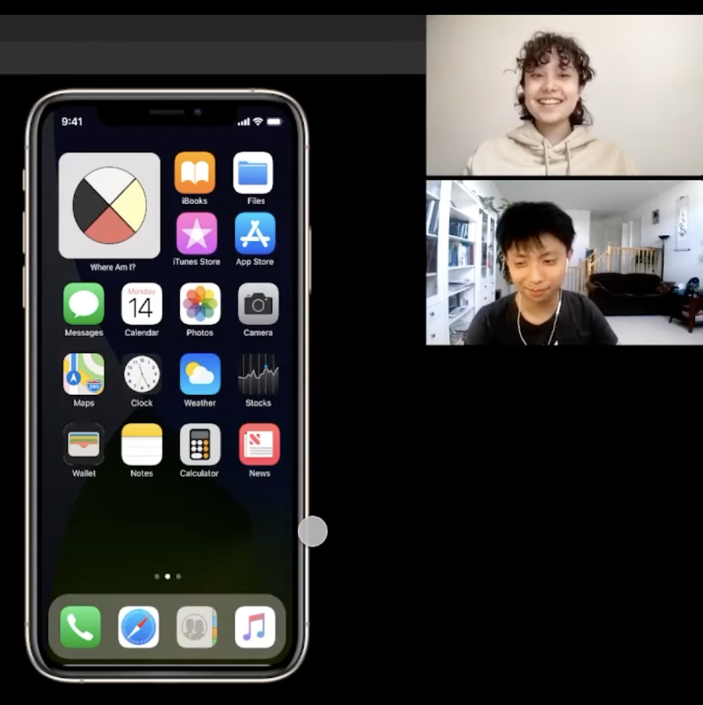

<h1>Reflection and Learning</h1>
 

This experience was essential; not only because of what I learned and the skills I gained, but also because of what I knowledge I gained through researching the content for the app itself.
  
 

<h5>What I learned</h5>

UX/UI design is an exciting field due to its use of creativity and logical thinking, and what you learn through preliminary and ongoing research can also be incredibly fascinating. For instance, despite this project being simply a prototype, I learned about indigenous history and current news while researching articles to include in our prototype. 

I also learned good Figma practice to keep design files neat, how to select a font and icons, and how to conduct research for UX and UI.

<h5>Improvements for next time</h5>

Before beginning conception, we conducted preliminary research on indigenous culture to make more consciously informed decisions in our designs. We found this to be very helpful and wanted to apply it throughout the entire design process, not just the before we began. However, due to the time constraint, we were not able to perform user interviews nor consult any indigenous people to make sure the app was designed sensitively. Given more time, I would have definitely done so to ensure that the app is designed as user-friendly and culturally sensitive as possible.
 
 

To conclude, one of the most essential things I learned was how valuable collaboration can be. We can all draw from each other's strengths and help our peers to create the best possible result! So, thank you to my co-designer for being a pleasure to work with.

 

To view the figma file of the final project, click the link below.
