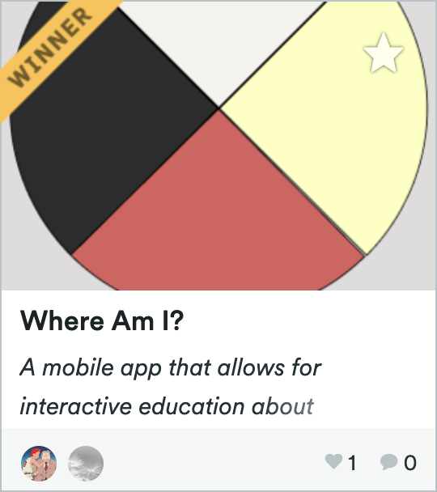
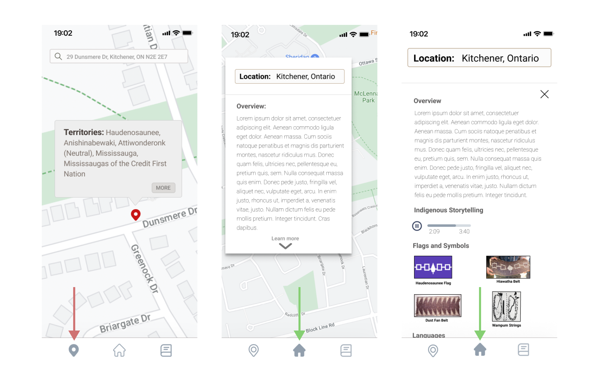

<h1>The Results</h1>
 

In the end, our prototype won <b>first place</b> in the beginner track! 

In the final product, we incorporated many of our original design ideas and added some new ones too.

For example, our initial design had assumed the information about the indigenous peoples would be accessed after clicking a info button and appear under the map section. We then realized that most information should be constained in the home tab and keep the map tab for just that: maps. This helped us stick to our goal of making the information easily accessible and to make the user experience cleaner.

We also changed a few icons, added a search bar in the map screen, and added filters for the news section, to name a few other changes.

 